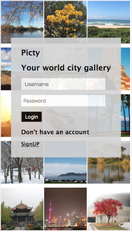
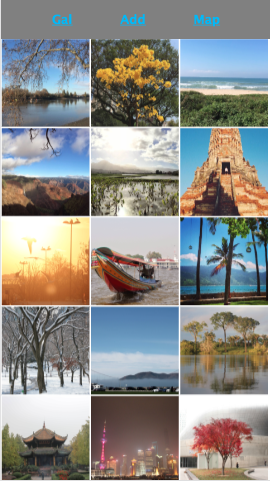

## Picty

PICTY - The App for your city pictures - [UNDER DEVELOPEMENT]

 

### Features

- Photos stored in Cloudnary, returning optimized image to the app.
- Search with Geocode returnig City name.
- GoogleMaps implementation with diferent icon.
- Rotate picture while editing.


### Instalation 

The app needs MongoDB instaled to work. 
Dowload and install it : https://www.mongodb.com/

```jsx
git clone https://github.com/dvidotti/My_Map_Places
npm install
```
* ADD .env with your Cloudnary KEY, NAME and PASSWORD. Inside .env add also your MONGO_URI address.
* ADD your API GOOGLE KEY.

### Purpose

- Have an app that store city memories and make it available in a map.
- Create city galeries.

## Next changes

- Split server and App [ RESTful-API & React (Serverless)]. 
- Algorithm for Feed. 
- Search bar.

## Contributing

A lot to do in CSS, new features to add and performance issues to solve, feel free to help! [this repository](https://github.com/dvidotti/My_Map_Places).


### License

React-Auth-ProtectedRoute is [MIT licensed](./LICENSE).